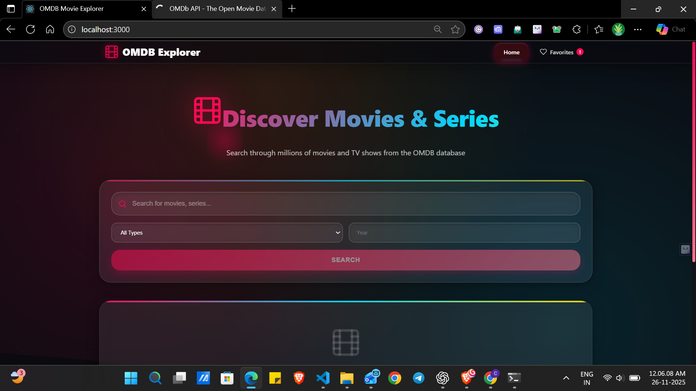
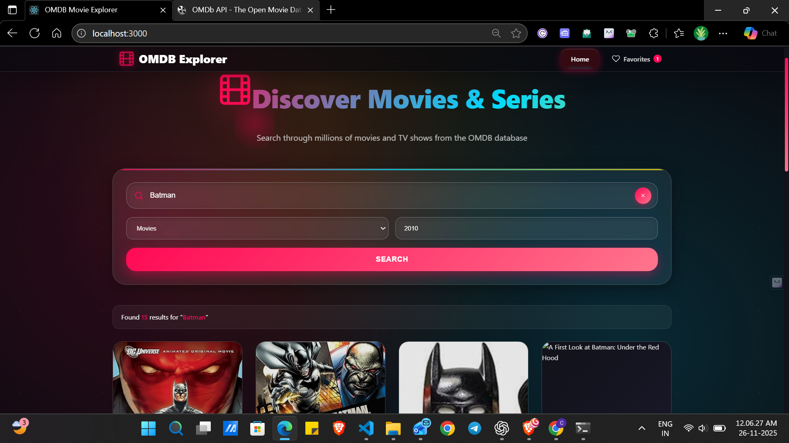
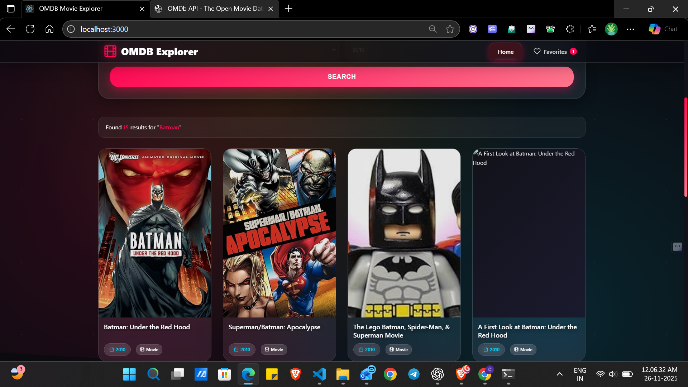
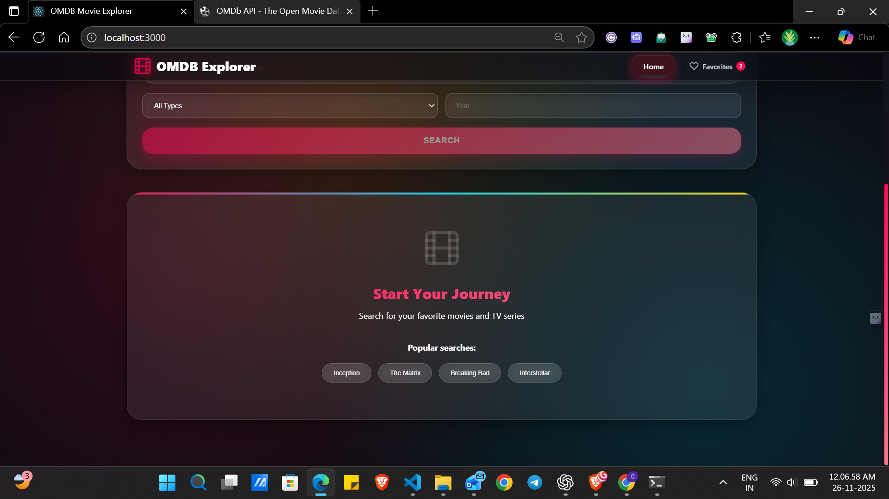
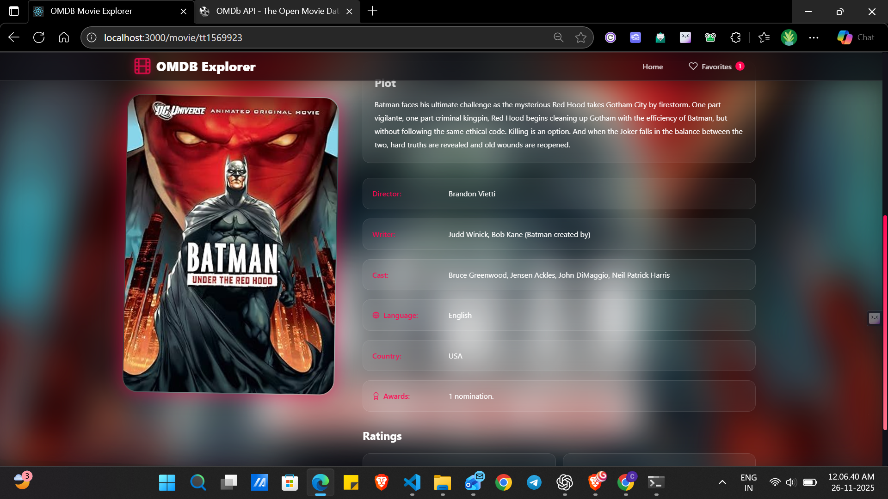
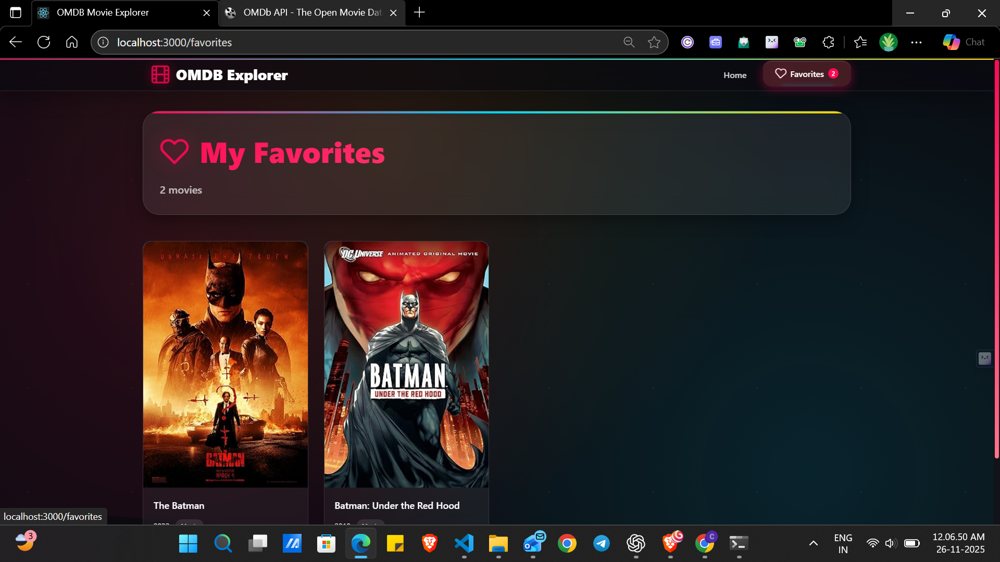

# 🎬 OMDB Movie Explorer

A full-stack movie exploration application built with React and Node.js, powered by the OMDB API. Features a premium UI/UX with glassmorphism design, 3D animations, and cosmic gradients.


## 🎥 Demo

**[Watch Video](https://drive.google.com/file/d/1yZ0jWMraivFxfcNqosu0FW38KoLNU7lJ/view?usp=sharing)**

### Screenshots








---

## ✨ Features

### Frontend
- 🎨 **Rich UI/UX** - Glassmorphism design with 60 FPS animations
- 🔍 **Advanced Search** - Search movies by title with filters (year, type)
- 📱 **Responsive Design** - Works seamlessly on all devices
- ❤️ **Favorites System** - Save and manage favorite movies
- 📄 **Pagination** - Navigate through large result sets
- 🎭 **Movie Details** - Comprehensive information with ratings and cast

### Backend
- 🚀 **RESTful API** - Clean, well-structured endpoints
- 💾 **Smart Caching** - In-memory cache with optional Redis support
- 🔒 **Security** - Rate limiting, CORS, and Helmet protection
- 🎯 **Error Handling** - Comprehensive logging and validation
- 🔑 **API Integration** - Secure OMDB API key management

---

## 📚 Documentation

- **[Quick Start](./docs/QUICKSTART.md)** - Get started in 5 minutes
- **[Architecture](./docs/ARCHITECTURE.md)** - System design and data flow
- **[API Testing](./docs/API_TESTING.md)** - Test API endpoints
- **[UI Features](./docs/UI_FEATURES.md)** - Premium design system guide
- **[Contributing](./docs/CONTRIBUTING.md)** - Development guidelines

---

## 🏗️ Architecture

```
omdb-movie-explorer/
├── backend/               # Node.js/Express API
│   ├── controllers/       # Request handlers
│   ├── middleware/        # Custom middleware
│   ├── routes/           # API routes
│   ├── services/         # Business logic
│   │   ├── omdbService.js      # OMDB API integration
│   │   └── cacheService.js     # Caching layer
│   └── server.js         # Application entry point
│
└── frontend/             # React application
    ├── src/
    │   ├── components/   # Reusable components
    │   ├── pages/        # Page components
    │   ├── services/     # API client
    │   ├── hooks/        # Custom hooks
    │   └── App.jsx       # App root
    └── public/           # Static assets
```

## 🚀 Getting Started

### Prerequisites

- Node.js (v16 or higher)
- npm or yarn
- OMDB API Key (Get free key at [https://www.omdbapi.com/apikey.aspx](https://www.omdbapi.com/apikey.aspx))
- Redis (optional, for distributed caching)

### Installation

1. **Clone the repository**

```bash
git clone https://github.com/GMahesh007/Movie_Explorer_.git
cd omdb-movie-explorer
```

2. **Setup Backend**

```bash
cd backend
npm install

# Create .env file from example
copy .env.example .env
```

Edit `.env` and add your OMDB API key:

```env
OMDB_API_KEY=your_actual_api_key_here
PORT=5000
NODE_ENV=development
CACHE_TTL=3600
CACHE_MAX_SIZE=1000
USE_REDIS=false
```

3. **Setup Frontend**

```bash
cd ../frontend
npm install
```

### Running the Application

**Option 1: Run Both Servers Separately**

Terminal 1 (Backend):

```bash
cd backend
npm start
# or for development with auto-reload:
npm run dev
```

Terminal 2 (Frontend):

```bash
cd frontend
npm run dev
```

**Option 2: Build and Deploy**

Build frontend:

```bash
cd frontend
npm run build
```

The application will be available at:

- Frontend: http://localhost:3000
- Backend API: http://localhost:5000

## 📡 API Documentation

### Base URL

```
http://localhost:5000/api
```

### Endpoints

#### 1. Search Movies

Search for movies by title with optional filters.

**GET** `/movies/search`

**Query Parameters:**

- `title` (required) - Movie title to search
- `page` (optional) - Page number (default: 1)
- `year` (optional) - Release year filter
- `type` (optional) - Type filter (movie, series, episode)

**Example:**

```bash
GET /api/movies/search?title=inception&page=1&year=2010
```

**Response:**

```json
{
  "success": true,
  "data": {
    "movies": [
      {
        "Title": "Inception",
        "Year": "2010",
        "imdbID": "tt1375666",
        "Type": "movie",
        "Poster": "https://..."
      }
    ],
    "totalResults": 1,
    "page": 1,
    "totalPages": 1
  },
  "cached": false
}
```

#### 2. Get Movie by IMDb ID

Get detailed information about a specific movie.

**GET** `/movies/:id`

**Parameters:**

- `id` (required) - IMDb ID (e.g., tt1375666)

**Query Parameters:**

- `plot` (optional) - Plot length (short, full) - default: full

**Example:**

```bash
GET /api/movies/tt1375666
```

**Response:**

```json
{
  "success": true,
  "data": {
    "imdbID": "tt1375666",
    "title": "Inception",
    "year": "2010",
    "rated": "PG-13",
    "released": "16 Jul 2010",
    "runtime": "148 min",
    "genre": "Action, Sci-Fi, Thriller",
    "director": "Christopher Nolan",
    "actors": "Leonardo DiCaprio, Joseph Gordon-Levitt, Ellen Page",
    "plot": "A thief who steals corporate secrets...",
    "poster": "https://...",
    "ratings": [
      {
        "Source": "Internet Movie Database",
        "Value": "8.8/10"
      }
    ],
    "imdbRating": "8.8",
    "imdbVotes": "2,200,000"
  },
  "cached": false
}
```

#### 3. Get Movie by Title

Get movie by exact title match.

**GET** `/movies/title/:title`

**Parameters:**

- `title` (required) - Exact movie title

**Query Parameters:**

- `year` (optional) - Release year
- `plot` (optional) - Plot length (short, full)

**Example:**

```bash
GET /api/movies/title/Inception?year=2010
```

#### 4. Health Check

Check API health status.

**GET** `/health`

**Response:**

```json
{
  "status": "OK",
  "timestamp": "2024-01-01T00:00:00.000Z",
  "uptime": 12345.67
}
```

### Error Responses

All endpoints return errors in this format:

```json
{
  "success": false,
  "error": "Error message here"
}
```

**Common HTTP Status Codes:**

- `400` - Bad Request (missing/invalid parameters)
- `404` - Not Found (movie not found)
- `429` - Too Many Requests (rate limit exceeded)
- `500` - Internal Server Error
- `503` - Service Unavailable (OMDB API timeout)

## 🎨 Frontend Features

### Pages

1. **Home Page** (`/`)

   - Search bar with filters
   - Movie grid with results
   - Pagination
   - Quick search suggestions
2. **Movie Detail Page** (`/movie/:id`)

   - Full movie information
   - Ratings from multiple sources
   - Cast and crew details
   - Add/remove favorites
3. **Favorites Page** (`/favorites`)

   - View all saved favorites
   - Quick access to details
   - Remove from favorites

### Components

- **Header** - Navigation with favorites badge
- **SearchBar** - Advanced search with filters
- **MovieCard** - Movie display card with hover effects
- **MovieGrid** - Responsive grid layout
- **Pagination** - Page navigation
- **Skeleton Loaders** - Loading states

## 🔧 Configuration

### Backend Configuration (.env)

```env
# Required
OMDB_API_KEY=your_api_key_here

# Optional
PORT=5000
NODE_ENV=development
FRONTEND_URL=http://localhost:3000

# Cache Configuration
CACHE_TTL=3600              # Cache time-to-live in seconds
CACHE_MAX_SIZE=1000         # Max items in memory cache
USE_REDIS=false             # Enable Redis cache

# Redis Configuration (if USE_REDIS=true)
REDIS_URL=redis://localhost:6379
```

### Caching Strategy

The application uses a two-tier caching approach:

1. **In-Memory Cache (Default)**

   - LRU (Least Recently Used) eviction
   - Configurable max size and TTL
   - No external dependencies
2. **Redis Cache (Optional)**

   - Distributed caching
   - Better for production/scaling
   - Set `USE_REDIS=true` to enable

Cache keys format:

- Search: `search:{title}:{page}:{year}:{type}`
- Movie by ID: `movie:{id}:{plot}`
- Movie by Title: `title:{title}:{year}:{plot}`


## 🛡️ Security Features

- **Rate Limiting** - 100 requests per 15 minutes per IP
- **CORS** - Configured for frontend origin
- **Helmet** - Security headers
- **Environment Variables** - Secure API key storage
- **Input Validation** - Parameter validation
- **Error Handling** - No sensitive data in errors

## 🎯 Performance Optimizations

### Backend

- Response caching with configurable TTL
- Request timeout handling
- Efficient error handling
- Minimal middleware stack

### Frontend

- Lazy loading images
- Code splitting with React Router
- Optimized re-renders
- Local storage for favorites
- Debounced search inputs
- Skeleton loading states

## 🧪 Testing

### Backend Tests

```bash
cd backend
npm test
```

### Frontend Tests

```bash
cd frontend
npm test
```

## 📦 Deployment

### Backend Deployment

1. **Set environment variables**
2. **Install dependencies**: `npm install --production`
3. **Start server**: `npm start`

Recommended platforms:

- Heroku
- Railway
- Render
- AWS EC2

### Frontend Deployment

1. **Build**: `npm run build`
2. **Deploy `dist/` folder**

Recommended platforms:

- Vercel
- Netlify
- GitHub Pages
- AWS S3 + CloudFront

## 🔍 Code Quality

- ✅ RESTful API design
- ✅ Security best practices (rate limiting, CORS, Helmet)
- ✅ Error handling and validation
- ✅ Responsive and accessible design
- ✅ Performance optimized (60 FPS animations)
- ✅ Clean architecture with separation of concerns

---

## 📝 License

This project is licensed under the MIT License.

## 🙏 Acknowledgments

- [OMDB API](https://www.omdbapi.com/) - Movie database
- [React](https://reactjs.org/) - Frontend framework
- [Express](https://expressjs.com/) - Backend framework

---

**Built with ❤️ for Movie Enthusiasts**
